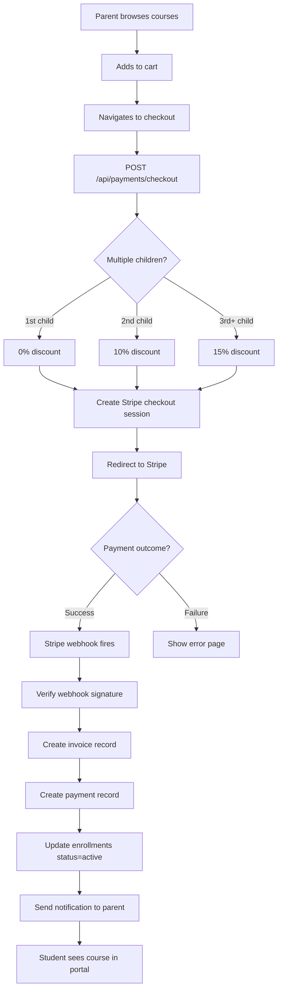
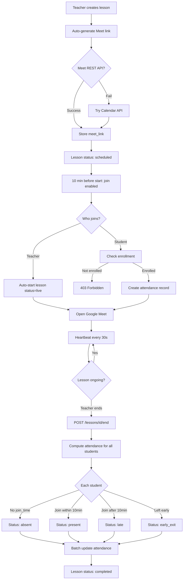
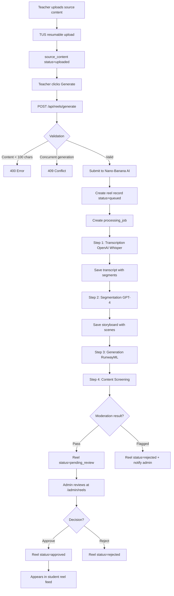
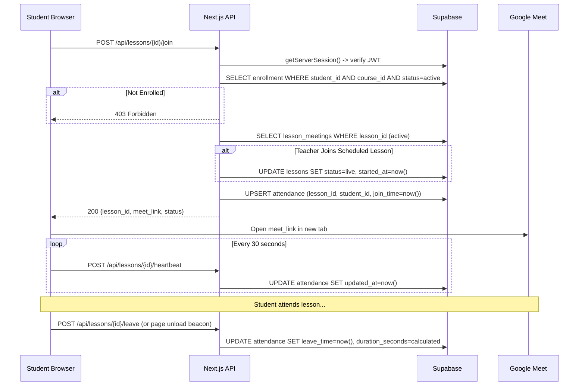
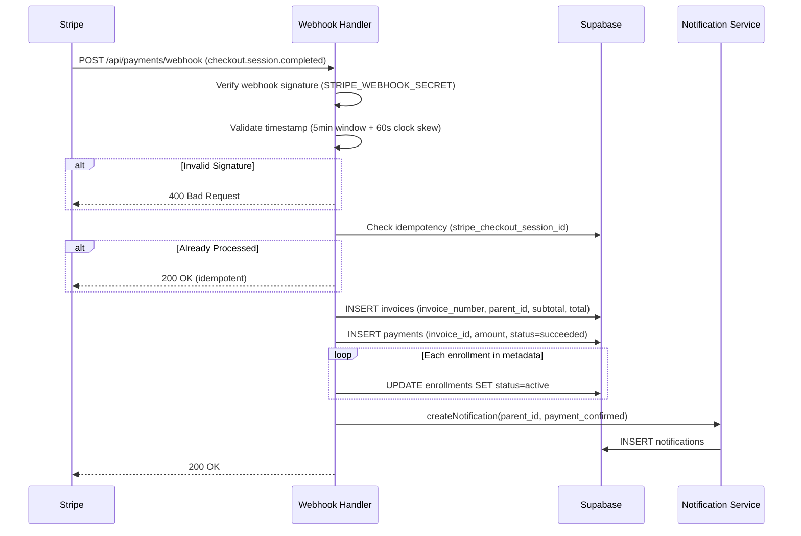
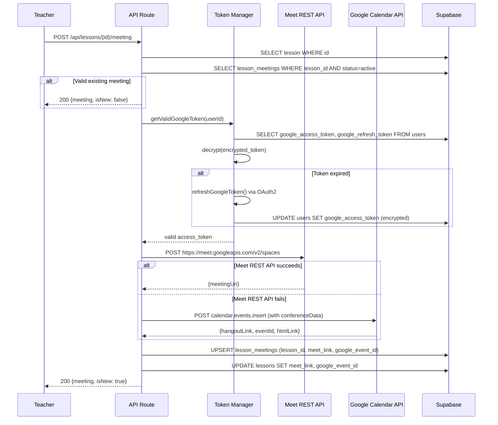
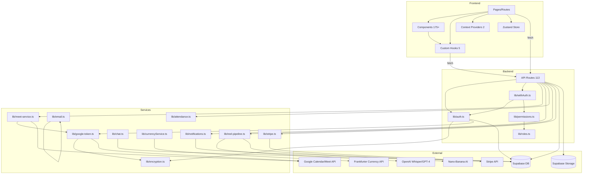

# Eduverse (Eman ISchool) - Complete System Documentation

> Reverse-engineered from source code on 2026-03-26. Every claim is backed by file-path evidence.

---

## Table of Contents

1. [Executive Summary](#1-executive-summary)
2. [Project Architecture Overview](#2-project-architecture-overview)
3. [Folder/Module Breakdown](#3-foldermodule-breakdown)
4. [Core Entity Inventory](#4-core-entity-inventory)
5. [Relationship Table](#5-relationship-table)
6. [Database / Data Model Analysis](#6-database--data-model-analysis)
7. [Frontend Pages and Route Map](#7-frontend-pages-and-route-map)
8. [API and Backend Logic Map](#8-api-and-backend-logic-map)
9. [Business Rules and Validations Table](#9-business-rules-and-validations-table)
10. [Role and Permission Matrix](#10-role-and-permission-matrix)
11. [State Transition Tables](#11-state-transition-tables)
12. [End-to-End User Flows](#12-end-to-end-user-flows)
13. [Mermaid ER Diagram](#13-mermaid-er-diagram)
14. [Mermaid Flow Diagrams](#14-mermaid-flow-diagrams)
15. [Mermaid Sequence Diagrams](#15-mermaid-sequence-diagrams)
16. [Dependency / Module Interaction Map](#16-dependency--module-interaction-map)
17. [Risks, Gaps, Dead Code, and Conflicts](#17-risks-gaps-dead-code-and-conflicts)
18. [Final System Explanation](#18-final-system-explanation)
19. [Appendix: File Paths and Proof References](#19-appendix-file-paths-and-proof-references)

---

## 1. Executive Summary

**Eduverse** (branded as **Eman ISchool** / **المدرسة الإلكترونية الأولى**) is an Arabic-first online education platform built with Next.js 14. It serves the Egyptian diaspora market, offering the Egyptian national curriculum and Al-Azhar curriculum through live Google Meet classes, recorded materials, AI-generated video reels, and assessments.

### Core Capabilities
- **Live Lessons** with Google Meet integration (auto-generated links, attendance tracking, heartbeat monitoring)
- **Course Management** with grade/subject hierarchy, enrollment workflows, and material attachments
- **Assessment System** (quizzes, exams, assignments) with auto-grading and manual review
- **AI Video Reels Pipeline** (transcription via OpenAI Whisper, segmentation via GPT-4, generation via RunwayML/Nano-Banana)
- **Payment Processing** via Stripe (checkout sessions, webhooks, sibling discounts)
- **Multi-Role Portals** for Admin, Teacher, Student, Parent, and Supervisor
- **PWA Support** with offline fallback, install banner, and service worker caching
- **Internationalization** (Arabic RTL default, English LTR, partial French)
- **VR Educational Experiences** (Three.js-based cell biology and solar system scenes)

### Tech Stack Summary
| Layer | Technology |
|-------|-----------|
| Framework | Next.js 14.2.35 (App Router) |
| Language | TypeScript 5.x |
| UI | React 18.3.1, Tailwind CSS v4, shadcn/ui (Radix), Lucide icons |
| Database | Supabase (PostgreSQL 15) |
| Auth | NextAuth 4.24.13 (JWT strategy, Google OAuth + Credentials) |
| State | Zustand 5.0.9, React Context |
| i18n | next-intl 4.7.0 |
| Payments | Stripe 14.14.0 |
| Video/AI | OpenAI (Whisper), RunwayML, Nano-Banana |
| 3D/VR | Three.js 0.171.0, @react-three/fiber, drei, xr |
| Mobile | Capacitor 8.x (Android/iOS shells) |
| CMS | Sanity 3.99.0 |
| Charts | Recharts 3.8.0 |
| Testing | Playwright 1.58.2, Jest 30.2.0 |
| PWA | next-pwa 5.6.0 |

---

## 2. Project Architecture Overview

### High-Level Architecture

```
┌─────────────────────────────────────────────────────────────────┐
│                         CLIENT LAYER                             │
│  ┌──────────┐ ┌──────────┐ ┌──────────┐ ┌──────────┐           │
│  │  Admin   │ │ Teacher  │ │ Student  │ │  Parent  │  + Public  │
│  │  Portal  │ │  Portal  │ │  Portal  │ │  Portal  │   Pages   │
│  └────┬─────┘ └────┬─────┘ └────┬─────┘ └────┬─────┘           │
│       └─────────────┴────────────┴─────────────┘                │
│                         │                                        │
│  ┌─────────────────────┼──────────────────────────┐             │
│  │  Zustand (cart)  │  Context (lang, PWA)  │  Hooks           │
│  └─────────────────────┼──────────────────────────┘             │
└────────────────────────┼────────────────────────────────────────┘
                         │ fetch / NextAuth
┌────────────────────────┼────────────────────────────────────────┐
│                    SERVER LAYER (Next.js API Routes)             │
│  ┌─────────────┐ ┌────────────┐ ┌─────────────┐                │
│  │  /api/auth   │ │ /api/courses│ │ /api/lessons │ ...113 routes│
│  └──────┬──────┘ └─────┬──────┘ └──────┬──────┘                │
│         └──────────────┼───────────────┘                         │
│                        │                                         │
│  ┌─────────────────────┼──────────────────────────┐             │
│  │  lib/auth.ts  │  lib/permissions.ts  │  lib/withAuth.ts     │
│  │  lib/meet-service.ts │ lib/notifications.ts │ lib/stripe.ts  │
│  └─────────────────────┼──────────────────────────┘             │
└────────────────────────┼────────────────────────────────────────┘
                         │ Supabase JS SDK
┌────────────────────────┼────────────────────────────────────────┐
│                    DATA LAYER                                    │
│  ┌─────────────────────┼──────────────────────────┐             │
│  │           Supabase PostgreSQL 15                │             │
│  │  users │ courses │ lessons │ enrollments │ ...  │             │
│  │  attendance │ assessments │ invoices │ payments  │             │
│  │  reels │ support_tickets │ materials │ grades   │             │
│  └─────────────────────┼──────────────────────────┘             │
│  ┌──────────┐ ┌────────┼────────┐ ┌──────────────┐             │
│  │ Supabase │ │  Google │Calendar│ │    Stripe    │             │
│  │ Storage  │ │  Meet   │  API   │ │   Payments   │             │
│  └──────────┘ └─────────────────┘ └──────────────┘             │
└─────────────────────────────────────────────────────────────────┘
```

### Data Access Pattern
- **Client-side**: `supabase` client (anon key, RLS enforced) - used sparingly
- **Server-side**: `supabaseAdmin` client (service role key, bypasses RLS) - used in all API routes
- **Pattern**: Next.js API routes act as BFF (Backend-for-Frontend); pages call API routes, API routes call Supabase

### Auth Flow
- **Strategy**: JWT (30-day expiry), stored in httpOnly cookie
- **Providers**: Google OAuth (with calendar.events scope) + Credentials (email/phone + bcrypt password)
- **Session enrichment**: JWT callback adds userId, role, googleId; session callback exposes them

### External Integrations
1. **Google Calendar/Meet** - Live lesson links (dual strategy: Meet REST API + Calendar API fallback)
2. **Stripe** - Checkout sessions, webhook processing, sibling discount logic
3. **OpenAI Whisper** - Audio transcription for reel pipeline
4. **GPT-4** - Content segmentation for reel storyboards
5. **RunwayML / Nano-Banana** - AI text-to-video generation
6. **Sanity CMS** - Blog/content management
7. **Frankfurter API** - Currency exchange rates (EGP base, 24h cache)
8. **Resend / Nodemailer** - Email sending (rate-limited: 10/hour)

---

## 3. Folder/Module Breakdown

```
src/
├── app/                          # Next.js App Router
│   ├── api/                      # 113 API route handlers
│   │   ├── auth/                 # NextAuth, register, forgot/reset-password
│   │   ├── courses/              # Course CRUD + publish
│   │   ├── lessons/              # Lesson CRUD + start/join/end/meeting/cancel
│   │   ├── grades/               # Grade CRUD + courses/students/fees/schedule
│   │   ├── subjects/             # Subject CRUD
│   │   ├── assessments/          # Assessment CRUD + submit/results
│   │   ├── attendance/           # Attendance read + report
│   │   ├── enrollments/          # Enrollment CRUD + approve/reject
│   │   ├── payments/             # Stripe checkout + webhook
│   │   ├── invoices/             # Invoice read
│   │   ├── reels/                # Reel CRUD + generate/publish/feed
│   │   ├── materials/            # Material CRUD
│   │   ├── notifications/        # Notification CRUD
│   │   ├── support/              # Support ticket CRUD + messages
│   │   ├── admin/                # Admin-only: users, stats, audit, bundles
│   │   ├── dashboard/            # Dashboard stats + teacher metrics
│   │   ├── integrations/         # Google connect/callback/status
│   │   ├── meetings/             # Meeting creation
│   │   ├── enrollment-applications/ # Application submission
│   │   ├── health/               # Health check + diagnostics
│   │   └── cron/                 # auto-end-lessons scheduled task
│   ├── [locale]/                 # Locale-aware routes
│   │   ├── (auth)/               # Login (admin/teacher/student), register
│   │   ├── (portal)/admin/       # Admin portal (courses, bundles, quizzes, reports)
│   │   ├── student/              # Student portal (home, courses, assessments, calendar, etc.)
│   │   ├── teacher/              # Teacher portal (home, courses, subjects, assessments, etc.)
│   │   ├── admin/                # Admin dashboard (legacy - students, teachers, grades, etc.)
│   │   ├── parent/               # Parent portal (home, students, courses, invoices, support)
│   │   ├── dashboard/            # Reference dashboard (overview, courses, bundles, etc.)
│   │   ├── enrollment/           # Public enrollment form
│   │   ├── checkout/             # Shopping cart checkout
│   │   ├── product/              # Product/course browsing
│   │   └── ...                   # Public pages (about, contact, grades, blogs, etc.)
│   └── studio/                   # Sanity CMS studio
├── components/                   # 175+ React components
│   ├── admin/                    # Admin layout, tables, widgets, modals
│   ├── auth/                     # LoginForm, ReferenceAuthCard, RoleGuard
│   ├── courses/                  # CourseCard, CourseCatalog, CourseFilters
│   ├── dashboard/                # ReferenceDashboardShell, workspaces, stats
│   ├── enrollment/               # MultiStepForm (5-step enrollment)
│   ├── grades/                   # GradeTabs, GradeDetailTabs, GradeFeesTab
│   ├── layout/                   # Header, Footer, ConditionalLayout, MobileDrawerNav
│   ├── lessons/                  # LessonDetailPage (6 tabs), AttendanceRoster
│   ├── parent/                   # ParentSideNav, QuickEnroll
│   ├── pwa/                      # InstallBanner, ServiceWorkerRegistration
│   ├── reels/                    # ReelFeed, SourceUploader, StoryboardEditor
│   ├── student/                  # StudentSideNav, ExamTaker, LessonCarousel
│   ├── subjects/                 # SubjectTabs, CourseCardsList
│   ├── support/                  # CreateTicketForm, TicketChat
│   ├── teacher/                  # TeacherSideNav, CreateCourseForm, AssessmentBuilder
│   ├── ui/                       # shadcn/ui primitives (button, card, input, etc.)
│   └── vr/                       # VRCanvas, CellScene, SolarSystemScene, hotspots
├── context/                      # LanguageContext (i18n + RTL/LTR)
├── contexts/                     # PwaInstallContext (install prompt state)
├── data/                         # egypt-curriculum.json (static curriculum data)
├── hooks/                        # 5 custom hooks
│   ├── useMeetingHeartbeat.ts    # Join/leave/heartbeat for live lessons
│   ├── usePermissions.ts         # Client-side RBAC checks
│   ├── useReelEngagement.ts      # Bookmark/progress tracking for reels
│   ├── useSourceUpload.ts        # TUS resumable file uploads
│   └── useVideoGeneration.ts     # AI video generation + polling
├── i18n/                         # i18n config (locales: ar, en, fr)
├── lib/                          # 70 service/utility files
│   ├── api/                      # Client-side API hooks (courses, users, payments, dashboard)
│   ├── notifications/            # NotificationService (multi-channel)
│   ├── auth.ts                   # NextAuth config (providers, callbacks, helpers)
│   ├── supabase.ts               # Supabase clients (anon + admin)
│   ├── permissions.ts            # Fine-grained RBAC (canCreate/Edit/View)
│   ├── roles.ts                  # Role constants and check functions
│   ├── withAuth.ts               # API route auth HOF
│   ├── encryption.ts             # AES-256-CBC token encryption
│   ├── google-token.ts           # Google OAuth token lifecycle
│   ├── meet-service.ts           # Meet link generation (dual strategy)
│   ├── meet.ts                   # Low-level Calendar event creation
│   ├── meet-utils.ts             # Meet URL validation
│   ├── meeting-feasibility.ts    # Join window checking
│   ├── lesson-meetings.ts        # Meeting CRUD + attendance integration
│   ├── attendance.ts             # Attendance status computation
│   ├── stripe.ts                 # Stripe server client
│   ├── stripe-client.ts          # Stripe browser client
│   ├── currencyService.ts        # Exchange rates (Frankfurter API, 24h cache)
│   ├── notifications.ts          # Simple notification helpers
│   ├── email.ts                  # Email (Resend/Nodemailer, rate-limited)
│   ├── sms.ts                    # SMS (mock implementation)
│   ├── chat.ts                   # Real-time chat (Supabase channels)
│   ├── reel-pipeline.ts          # Reel generation orchestrator
│   ├── runway-api.ts             # RunwayML text-to-video
│   ├── nano-banana.ts            # Alternative AI video generation
│   ├── transcription-api.ts      # OpenAI Whisper transcription
│   ├── content-segmenter.ts      # GPT-4 content segmentation
│   ├── reel-validation.ts        # Material eligibility checking
│   ├── video-storage.ts          # Supabase storage for videos
│   ├── file-validation.ts        # File size/type validation
│   ├── external-video.ts         # YouTube/Vimeo metadata extraction
│   ├── curriculum.ts             # Static curriculum data helpers
│   ├── store.ts                  # Zustand cart store
│   └── ...                       # Utils (request-id, crash-reporter, locale-path, etc.)
├── types/                        # TypeScript type definitions
│   ├── database.ts               # All Supabase table types (28+ entities)
│   ├── api.ts                    # API response types
│   ├── notifications.ts          # Notification types
│   ├── vr.ts                     # VR experience types
│   ├── builds.ts                 # Mobile build types
│   ├── session-form.ts           # Form schema types
│   └── page-state.ts             # DataState<T> machine types
├── middleware.ts                  # next-intl locale routing (no auth checks)
├── i18n.ts                       # Server-side i18n config
├── sanity/                       # Sanity CMS schema and config
└── __tests__/                    # Unit tests (Jest)

messages/                         # i18n translation files
├── ar.json                       # Arabic (~24KB)
├── en.json                       # English (~20KB)
└── fr.json                       # French (~2.6KB, partial)

public/
├── manifest.json                 # PWA manifest (RTL, standalone, dark theme)
├── icons/                        # PWA icons (192, 512, maskable)
├── sw.js                         # Service worker (generated by next-pwa)
└── ...                           # Static assets

tests/                            # E2E tests (Playwright)
```

---

## 4. Core Entity Inventory

### 4.1 Users

| Property | Value |
|----------|-------|
| **Purpose** | All platform actors (students, teachers, admins, parents, supervisors) |
| **Defined in** | `src/types/database.ts` |
| **Table** | `users` |

| Field | Type | Required | Notes |
|-------|------|----------|-------|
| id | string (UUID) | Yes | Primary key |
| email | string | Yes | Unique |
| name | string | Yes | |
| password_hash | string \| null | No | bcrypt hashed |
| image | string \| null | No | Profile picture URL |
| role | UserRole | Yes | 'student' \| 'teacher' \| 'admin' \| 'parent' \| 'supervisor' |
| google_id | string \| null | No | Google OAuth ID |
| phone | string \| null | No | With country code |
| bio | string \| null | No | |
| is_active | boolean | Yes | Default: true |
| email_verified | boolean | Yes | Default: false |
| stripe_customer_id | string \| null | No | Stripe integration |
| google_access_token | string \| null | No | Encrypted (AES-256) |
| google_refresh_token | string \| null | No | Encrypted (AES-256) |
| google_token_expires_at | string \| null | No | ISO timestamp |
| last_login | string \| null | No | |
| created_at | string | Yes | Auto |
| updated_at | string | Yes | Auto |

**Created by**: Registration API (`POST /api/auth/register` - default role: parent), Google OAuth sign-in (default role: student), Admin user management
**Read by**: Auth callbacks, all API routes (via getCurrentUser), admin user list
**Updated by**: Auth callbacks (last_login, Google tokens), admin PATCH, profile updates
**Deleted by**: Not implemented (soft delete via is_active)

---

### 4.2 Courses

| Property | Value |
|----------|-------|
| **Purpose** | Educational course offerings tied to grades and subjects |
| **Defined in** | `src/types/database.ts` |
| **Table** | `courses` |

| Field | Type | Required | Notes |
|-------|------|----------|-------|
| id | string (UUID) | Yes | PK |
| title | string | Yes | |
| slug | string | Yes | Unique, auto-generated |
| description | string \| null | No | |
| price | number | Yes | Default: 0 |
| currency | string | Yes | Default: 'EGP' |
| duration_hours | number \| null | No | |
| image_url | string \| null | No | |
| thumbnail_url | string \| null | No | |
| subject_id | string \| null | No | FK to subjects |
| subject | string \| null | No | Denormalized |
| grade_level | string \| null | No | Denormalized |
| grade_id | string \| null | No | FK to grades |
| teacher_id | string \| null | No | FK to users |
| is_published | boolean | Yes | Default: false |
| max_students | number | Yes | Default: 30 |
| enrollment_type | string | Yes | 'free' \| 'paid' \| 'subscription' |
| subscription_interval | string \| null | No | 'monthly' \| 'yearly' |
| stripe_price_id | string \| null | No | |
| created_at | string | Yes | Auto |
| updated_at | string | Yes | Auto |

**Created by**: Teachers/Admins via `POST /api/courses`
**Read by**: Course listing (role-filtered), course detail, enrollment flows
**Updated by**: `PATCH /api/courses` (owner or admin), publish action
**Deleted by**: `DELETE /api/courses` (owner or admin)
**Publish validation**: Must have title, grade, and >= 1 lesson

---

### 4.3 Lessons

| Property | Value |
|----------|-------|
| **Purpose** | Scheduled class sessions within courses, with Google Meet integration |
| **Defined in** | `src/types/database.ts` |
| **Table** | `lessons` |

| Field | Type | Required | Notes |
|-------|------|----------|-------|
| id | string (UUID) | Yes | PK |
| title | string | Yes | |
| description | string \| null | No | |
| start_date_time | string | Yes | ISO timestamp |
| end_date_time | string | Yes | ISO timestamp |
| recurrence | string \| null | No | Recurrence rule |
| recurrence_end_date | string \| null | No | |
| meet_link | string \| null | No | Google Meet URL |
| meeting_title | string \| null | No | |
| meeting_provider | enum \| null | No | 'google_meet' \| 'zoom' \| 'teams' \| 'other' |
| meeting_duration_min | number \| null | No | |
| google_event_id | string \| null | No | |
| google_calendar_link | string \| null | No | |
| status | LessonStatus | Yes | 'scheduled' \| 'live' \| 'completed' \| 'cancelled' |
| course_id | string \| null | No | FK to courses |
| teacher_id | string \| null | No | FK to users |
| recording_url | string \| null | No | |
| recording_drive_file_id | string \| null | No | |
| sort_order | number | Yes | |
| notes | string \| null | No | |
| teacher_notes | string \| null | No | Internal |
| cancellation_reason | string \| null | No | |
| rescheduled_from | string \| null | No | FK to lessons |
| created_at | string | Yes | Auto |
| updated_at | string | Yes | Auto |

**Created by**: Teachers via lesson creation API
**Lifecycle**: scheduled -> live (teacher starts/joins) -> completed (teacher ends)
**Meet link**: Auto-generated via Google Calendar/Meet API on creation

---

### 4.4 Enrollments

| Field | Type | Required | Notes |
|-------|------|----------|-------|
| id | string (UUID) | Yes | PK |
| student_id | string | Yes | FK to users |
| course_id | string | Yes | FK to courses |
| status | EnrollmentStatus | Yes | 'active' \| 'completed' \| 'dropped' \| 'pending' \| 'payment_pending' \| 'payment_completed' \| 'rejected' |
| enrollment_date | string | Yes | |
| start_date | string \| null | No | |
| end_date | string \| null | No | |
| grade_id | string \| null | No | FK to grades |
| created_at | string | Yes | Auto |
| updated_at | string | Yes | Auto |

**Created by**: Direct enrollment (teacher/admin: status=active), Parent enrollment (status=pending), Stripe webhook (status=active after payment)

---

### 4.5 Grades

| Field | Type | Required | Notes |
|-------|------|----------|-------|
| id | string (UUID) | Yes | PK |
| name | string | Yes | Arabic name |
| name_en | string \| null | No | English name |
| slug | string | Yes | Unique |
| sort_order | number | Yes | |
| is_active | boolean | Yes | Default: true |
| supervisor_id | string \| null | No | FK to users |
| description | string \| null | No | |
| image_url | string \| null | No | |
| created_at | string | Yes | Auto |

---

### 4.6 Subjects

| Field | Type | Required | Notes |
|-------|------|----------|-------|
| id | string (UUID) | Yes | PK |
| title | string | Yes | |
| slug | string | Yes | Unique |
| description | string \| null | No | |
| teacher_id | string \| null | No | FK to users |
| image_url | string \| null | No | |
| sort_order | number | Yes | |
| is_active | boolean | Yes | Default: true |
| created_at | string | Yes | Auto |
| updated_at | string | Yes | Auto |

---

### 4.7 Attendance

| Field | Type | Required | Notes |
|-------|------|----------|-------|
| id | string (UUID) | Yes | PK |
| lesson_id | string | Yes | FK to lessons |
| student_id | string | Yes | FK to users |
| status | AttendanceStatus | Yes | 'present' \| 'absent' \| 'late' \| 'early_exit' |
| join_time | string \| null | No | ISO timestamp |
| leave_time | string \| null | No | ISO timestamp |
| duration_seconds | number \| null | No | Computed |

**Computed rules** (`src/lib/attendance.ts`):
- `absent`: no join_time
- `present`: join within 10 min of lesson start
- `late`: join after 10 min threshold
- `early_exit`: leave > threshold before lesson end

---

### 4.8 Assessments

| Field | Type | Notes |
|-------|------|-------|
| id | UUID | PK |
| teacher_id | string | FK to users (required) |
| course_id | string \| null | FK to courses |
| subject_id | string \| null | FK to subjects |
| lesson_id | string \| null | FK to lessons |
| title | string | Required |
| short_description | string \| null | |
| long_description | string \| null | |
| duration_minutes | number \| null | Time limit |
| is_published | boolean | Default: false |
| assessment_type | string \| null | 'quiz' \| 'exam' \| 'assignment' |
| attempt_limit | number \| null | |

**Sub-entities**: assessment_questions, assessment_submissions, assessment_answers

---

### 4.9 Materials

| Field | Type | Notes |
|-------|------|-------|
| id | UUID | PK |
| title | string | Required |
| type | MaterialType | 'file' \| 'link' \| 'book' \| 'image' \| 'video' |
| file_url | string \| null | Supabase Storage URL |
| course_id | string | FK to courses (required) |
| lesson_id | string \| null | FK to lessons |
| uploaded_by | string | FK to users (required) |

---

### 4.10 Invoices & Payments

**Invoices**: invoice_number, parent_id, status (draft/pending/paid/overdue/cancelled/refunded), subtotal, discount_amount, tax_amount, total, currency, due_date

**Payments**: invoice_id, parent_id, stripe_payment_intent_id, stripe_checkout_session_id, amount, status (pending/succeeded/failed/refunded), payment_method

**Invoice Items**: invoice_id, student_id, course_id, enrollment_id, unit_price, discount_percent, total

---

### 4.11 Support Tickets

**Tickets**: ticket_number, user_id, category (technical/billing/enrollment/general), subject, status (open/in_progress/waiting_user/resolved/closed), priority (low/medium/high/urgent), assigned_to

**Messages**: ticket_id, sender_id, message, attachments (JSONB), is_internal

---

### 4.12 Enrollment Applications

**Fields**: parent_id, student_id, grade_id, course_id, status (pending/payment_pending/payment_completed/approved/rejected), submitted_at, reviewed_at, reviewed_by, notes

---

### 4.13 Meetings (lesson_meetings)

**Fields**: lesson_id (unique), meet_link, google_event_id, google_calendar_link, status (created/active/ended), started_at, ended_at, recording_drive_file_id, created_by

---

### 4.14 AI Reel Pipeline Entities

**source_content**: teacher_id, type (video/document/recording/external_link), file_url, status (uploaded/processing/transcribing/ready/failed)

**transcripts**: source_id, text, segments (JSONB), language, confidence, word_count

**storyboards**: source_id, target_audience, scenes (JSONB), summary, estimated_duration

**processing_jobs**: source_id, type (transcription/segmentation/generation), status (pending/processing/paused/completed/failed), progress_percent, retry_count

**reels**: status (queued/processing/pending_review/approved/rejected/failed), video_url, thumbnail_url, duration_seconds, teacher_id

---

### 4.15 Other Entities

- **Orders**: user_id, type (enrollment/invoice_request/support/class_change/refund/general), status
- **Discounts**: name, type (sibling/coupon/promotional), discount_type (percentage/fixed), value, min_siblings
- **Student Performance**: student_id, course_id, overall_score, attendance_score, weak_areas (JSONB)
- **Parent-Student**: parent_id, student_id, relationship
- **Reel Visibility**: reel_id, visibility_type (class/grade_level/group)
- **External Video Links**: reel_id, provider (youtube/vimeo/other), external_id, url
- **Audit Logs**: user_id, action, old_data (JSONB), new_data (JSONB)

---

## 5. Relationship Table

| Entity A | Relationship | Entity B | Cardinality | Source Evidence | Created At | Used In UI |
|----------|-------------|----------|-------------|-----------------|------------|------------|
| users | teaches | courses | 1:N | `courses.teacher_id` FK | Course creation | Teacher portal, course cards |
| users | supervises | grades | 1:N | `grades.supervisor_id` FK | Grade creation/assignment | Admin grade mgmt |
| users | enrolled_in | courses | N:M (via enrollments) | `enrollments` join table | Enrollment API | Student course list |
| users | parent_of | users | N:M (via parent_student) | `parent_student` table | Parent portal | Parent dashboard |
| users | submits | assessment_submissions | 1:N | `assessment_submissions.student_id` | ExamTaker submit | Assessment results |
| users | creates | support_tickets | 1:N | `support_tickets.user_id` | Support form | Support portal |
| users | receives | notifications | 1:N | `notifications.user_id` | Various triggers | Notification bell |
| users | owns | invoices | 1:N | `invoices.parent_id` | Stripe webhook | Parent invoices |
| courses | belongs_to | grades | N:1 | `courses.grade_id` FK | Course creation | Grade detail, filters |
| courses | categorized_by | subjects | N:1 | `courses.subject_id` FK | Course creation | Subject filters |
| courses | contains | lessons | 1:N | `lessons.course_id` FK | Lesson creation | Course detail page |
| courses | has | materials | 1:N | `materials.course_id` FK | Material upload | Lesson materials tab |
| courses | has | assessments | 1:N | `assessments.course_id` FK | Assessment creation | Assessment list |
| courses | has | enrollments | 1:N | `enrollments.course_id` FK | Enrollment | Enrollment count |
| lessons | has | attendance | 1:N | `attendance.lesson_id` FK | Join/leave actions | Attendance roster |
| lessons | has_one | meetings | 1:1 | `lesson_meetings.lesson_id` UNIQUE | Meeting creation | Join button |
| lessons | has | materials | 1:N | `materials.lesson_id` FK | Material attachment | Lesson materials tab |
| assessments | has | questions | 1:N | `assessment_questions.assessment_id` FK | Assessment builder | ExamTaker |
| assessments | has | submissions | 1:N | `assessment_submissions.assessment_id` FK | Student submission | Results page |
| submissions | has | answers | 1:N | `assessment_answers.submission_id` FK | Answer recording | Grading view |
| invoices | has | items | 1:N | `invoice_items.invoice_id` FK | Invoice generation | Invoice detail |
| invoices | has | payments | 1:N | `payments.invoice_id` FK | Stripe webhook | Payment history |
| support_tickets | has | messages | 1:N | `ticket_messages.ticket_id` FK | Message posting | Ticket chat |
| source_content | has | transcripts | 1:1 | `transcripts.source_id` FK | Transcription job | Transcript viewer |
| source_content | has | storyboards | 1:1 | `storyboards.source_id` FK | Storyboard gen | Storyboard editor |
| source_content | has | processing_jobs | 1:N | `processing_jobs.source_id` FK | Pipeline start | Processing status |
| grades | has | courses | 1:N | `courses.grade_id` FK | Course creation | Grade courses tab |
| subjects | has | courses | 1:N | `courses.subject_id` FK | Course creation | Subject courses tab |

---

## 6. Database / Data Model Analysis

### Database Views (defined in Supabase)

| View | Purpose | Key Columns |
|------|---------|-------------|
| `lesson_stats` | Aggregated attendance per lesson | lesson_id, present_count, absent_count, late_count, total_students |
| `user_attendance_summary` | Per-user attendance rates | user_id, total_lessons, lessons_attended, attendance_rate |
| `teacher_performance` | Teacher metrics | teacher_id, courses_count, total_students, avg_attendance_rate |
| `dashboard_stats` | System-wide KPIs | total_students, total_teachers, total_courses, today_lessons |

### Enum/Status Values

| Entity | Field | Values |
|--------|-------|--------|
| users | role | student, teacher, admin, parent, supervisor |
| courses | enrollment_type | free, paid, subscription |
| lessons | status | scheduled, live, completed, cancelled |
| enrollments | status | active, completed, dropped, pending, payment_pending, payment_completed, rejected |
| attendance | status | present, absent, late, early_exit |
| assessments | assessment_type | quiz, exam, assignment |
| submissions | status | started, submitted, graded |
| invoices | status | draft, pending, paid, overdue, cancelled, refunded |
| payments | status | pending, succeeded, failed, refunded, partially_refunded |
| support_tickets | status | open, in_progress, waiting_user, resolved, closed |
| support_tickets | priority | low, medium, high, urgent |
| support_tickets | category | technical, billing, enrollment, general |
| orders | type | enrollment, invoice_request, support, class_change, refund, general |
| orders | status | pending, processing, resolved, rejected, cancelled |
| reels | status | queued, processing, pending_review, approved, rejected, failed |
| source_content | status | uploaded, processing, transcribing, ready, failed |
| processing_jobs | type | transcription, segmentation, generation |
| processing_jobs | status | pending, processing, paused, completed, failed |
| meetings | status | created, active, ended |
| materials | type | file, link, book, image, video |
| discounts | type | sibling, coupon, promotional |
| enrollment_applications | status | pending, payment_pending, payment_completed, approved, rejected |

### Data Access Patterns

| Pattern | Example | Files Using |
|---------|---------|-------------|
| SELECT with filter | `supabaseAdmin.from('courses').select('*').eq('teacher_id', userId)` | All GET routes |
| JOIN queries | `.select('*, teacher:users!courses_teacher_id_fkey(id, name)')` | Courses, lessons, grades |
| Count queries | `.select('*', { count: 'exact' })` | Paginated lists |
| Upsert | `.upsert(record, { onConflict: 'lesson_id' })` | lesson_meetings |
| Text search | `.or('title.ilike.%${term}%,description.ilike.%${term}%')` | Course/user search |
| Batch insert | `.insert([record1, record2, ...])` | Attendance batch updates |
| Pagination | `.range(offset, offset + limit - 1)` | All list endpoints |

### Caching Headers

| Route | Cache | Stale-While-Revalidate |
|-------|-------|----------------------|
| GET /api/courses | 60s | 300s (5min) |
| GET /api/lessons | 30s | 150s (2.5min) |
| GET /api/grades | 120s | 600s (10min) |
| GET /api/subjects | 120s | 600s (10min) |
| GET /api/attendance | 60s | 300s (5min) |

### Denormalization

- `courses.subject` and `courses.grade_level` are denormalized copies of the subject title and grade name, avoiding joins in common queries
- Dashboard views pre-aggregate attendance/performance metrics

### Mock Data vs Real Data

- **Real data**: All Supabase PostgreSQL tables
- **Static data**: `src/data/egypt-curriculum.json` — curriculum structure (stages, grades, subjects) for UI dropdowns
- **Reference data**: `src/lib/dashboard-applications.ts`, `src/lib/reference-session-normalization.ts` — demo/reference flows

---

## 7. Frontend Pages and Route Map

### Public Pages (No Auth)

| Route | Page | Purpose |
|-------|------|---------|
| `/[locale]` | Landing page | Hero, benefits, testimonials, tracks, CTAs |
| `/[locale]/about-us` | About | Company info |
| `/[locale]/contact` | Contact | Contact form |
| `/[locale]/grades` | Grades listing | Browse grade levels |
| `/[locale]/grades/[id]` | Grade detail | Courses in grade |
| `/[locale]/national-school` | National School | Egyptian curriculum track |
| `/[locale]/al-azhar-school` | Al-Azhar School | Al-Azhar curriculum track |
| `/[locale]/exam-simulation` | Exam simulation | Practice exams |
| `/[locale]/product/by-subject` | Course catalog | Browse by subject |
| `/[locale]/enrollment` | Enrollment form | 5-step multi-step form |
| `/[locale]/enrollment/success` | Success | Confirmation page |
| `/[locale]/checkout` | Checkout | Cart + Stripe |
| `/[locale]/blogs` | Blog | Sanity CMS content |
| `/[locale]/offline` | Offline | PWA offline fallback |

### Auth Pages

| Route | Page | Purpose |
|-------|------|---------|
| `/[locale]/(auth)/login` | Generic login | ReferenceAuthCard (login/join tabs) |
| `/[locale]/(auth)/login/admin` | Admin login | Blue shield icon, phone+password |
| `/[locale]/(auth)/login/teacher` | Teacher login | Teal book icon, phone+password |
| `/[locale]/(auth)/login/student` | Student login | Green grad cap, phone+password |
| `/[locale]/(auth)/register` | Registration | Full name, email, phone, password, consent |
| `/[locale]/auth/forgot-password` | Forgot password | Email input, sends reset link |
| `/[locale]/auth/reset-password` | Reset password | Token + new password (12+ chars) |

### Student Portal (`/[locale]/student/`)

| Route | Data Fetched | Actions |
|-------|-------------|---------|
| `/student/home` | Announcements, mock lessons/teachers/subjects | View announcements, join lessons |
| `/student/courses` | `GET /api/courses` (enrolled only) | Filter by status, navigate to detail |
| `/student/courses/[id]` | Course + enrollments | View info, lessons list |
| `/student/courses/[id]/lessons/[lessonId]` | Lesson + materials | View info, join meet |
| `/student/assessments` | Supabase: enrollments -> assessments | Start/resume/retake assessments |
| `/student/assessments/[id]/take` | Assessment + questions | Answer questions, auto-submit on timer |
| `/student/calendar` | Upcoming lessons/events | Calendar view |
| `/student/attendance` | Attendance records | View stats |
| `/student/support` | Support tickets | Create/view tickets |
| `/student/chat` | Messages | Send/receive |
| `/student/reels` | Video content | Watch reels |
| `/student/profile` | User profile | Edit profile |

### Teacher Portal (`/[locale]/teacher/`)

| Route | Data Fetched | Actions |
|-------|-------------|---------|
| `/teacher/home` | Stats (courses, subjects, lessons, students, pending grading) | Dashboard overview |
| `/teacher/courses` | `GET /api/courses` (own) | Create course, view details |
| `/teacher/courses/new` | Grade levels, subjects | Create course form |
| `/teacher/courses/[id]` | Course full data | Edit, manage lessons/students |
| `/teacher/subjects` | Subjects with course counts | Create, manage subjects |
| `/teacher/assessments` | Published assessments | Create/edit/delete |
| `/teacher/assessments/new` | Courses, subjects, lessons | AssessmentBuilder |
| `/teacher/assessments/[id]/results` | Submissions + grades | View/grade submissions |
| `/teacher/lessons` | Lessons for own courses | Create/edit |
| `/teacher/lessons/[id]` | Full lesson data | View/edit, manage attendance |
| `/teacher/lessons/[id]/attendance` | Attendance records | Mark present/absent |
| `/teacher/grades` | Enrolled students, grades | View summaries |
| `/teacher/calendar` | Schedule | Calendar view |
| `/teacher/reels/upload` | Upload form | Upload videos |
| `/teacher/reels` | Teacher's reels | Manage published |
| `/teacher/profile` | Teacher profile | Edit |

### Admin Portal (Legacy: `/[locale]/admin/` + Reference: `/[locale]/dashboard/`)

| Route | Purpose |
|-------|---------|
| `/admin/home` | Redirects to /dashboard |
| `/admin/students` | Student management |
| `/admin/teachers` | Teacher management |
| `/admin/users` | All user management |
| `/admin/grades` | Grade hierarchies |
| `/admin/grades/[id]` | Grade detail (tabs: info, students, fees, courses, schedule) |
| `/admin/lessons` | All lessons |
| `/admin/attendance` | Attendance tracking |
| `/admin/fees` | Fee management |
| `/admin/enrollment-applications` | Application review |
| `/admin/enrollment-reports` | Enrollment analytics |
| `/admin/support` | Ticket management |
| `/admin/settings` | System config |
| `/dashboard` | Overview (redirects by role) |
| `/dashboard/courses` | Course catalog workspace |
| `/dashboard/bundles` | Bundle management |
| `/dashboard/exams` | Exam management |
| `/dashboard/quizzes` | Quiz management |
| `/dashboard/users` | User CRUD |
| `/dashboard/payments` | Payment workspace |
| `/dashboard/fees` | Fee config |
| `/dashboard/calendar` | System calendar |
| `/dashboard/settings` | Global settings |

### Parent Portal (`/[locale]/parent/`)

| Route | Data Fetched | Actions |
|-------|-------------|---------|
| `/parent/home` | Linked students, enrollments, payments, grades | View children, enroll |
| `/parent/students/add` | Grade levels | Link/add child |
| `/parent/courses` | Children's courses | View |
| `/parent/invoices` | Parent invoices | View/download |
| `/parent/invoices/[id]` | Invoice detail | View |
| `/parent/support` | Support tickets | Create/view |

---

## 8. API and Backend Logic Map

### API Route Summary (113 total)

| Category | Route | Method | Auth | Key Logic |
|----------|-------|--------|------|-----------|
| **Auth** | `/api/auth/[...nextauth]` | GET/POST | Public | NextAuth handler |
| | `/api/auth/register` | POST | Public | Create user (role=parent), bcrypt hash, phone normalization |
| | `/api/auth/forgot-password` | POST | Public | Rate limit (15min), SHA-256 token hash, 1h expiry |
| | `/api/auth/reset-password` | POST | Public | Token verification, password complexity (12+ chars), entropy check |
| **Courses** | `/api/courses` | GET | Optional | Role-filtered: admin=all, teacher=own, student=enrolled, public=published |
| | `/api/courses` | POST | Teacher/Admin | Slug generation, grade validation, default unpublished |
| | `/api/courses` | PATCH | Owner/Admin | Publish validation (title+grade+1 lesson), field allowlist |
| | `/api/courses` | DELETE | Owner/Admin | Ownership check |
| **Lessons** | `/api/lessons` | GET | Auth | Filter by status/course/teacher, enrollment check for students |
| | `/api/lessons` | POST | Teacher/Admin | Auto-creates Google Meet link, notifies enrolled students |
| | `/api/lessons/[id]/start` | POST | Teacher/Admin | Status: scheduled/cancelled -> live |
| | `/api/lessons/[id]/join` | POST | Student/Teacher | Enrollment check, creates attendance record, returns meet_link |
| | `/api/lessons/[id]/end` | POST | Teacher/Admin | Computes attendance (join/leave times), batch updates, status=completed |
| | `/api/lessons/[id]/meeting` | POST | Teacher/Admin | Get or create Meet link (dual strategy) |
| | `/api/lessons/[id]/heartbeat` | POST | Auth | Attendance keepalive |
| | `/api/lessons/[id]/cancel` | POST | Teacher/Admin | Status=cancelled |
| **Enrollments** | `/api/enrollments` | GET | Auth | Admin=all, student=own, filter by status/course/parent |
| | `/api/enrollments` | POST | Auth | Teacher/Admin: active; Parent: pending (needs approval) |
| | `/api/enrollments` | PATCH | Admin | Approve/reject with notification |
| **Payments** | `/api/payments/checkout` | POST | Parent | Sibling discount (0%/10%/15%), Stripe session, idempotency hash |
| | `/api/payments/webhook` | POST | Stripe | Signature verification, creates invoice+payment, activates enrollments |
| **Grades** | `/api/grades` | GET | Auth | Supervisor=supervised only, teacher=assigned, admin=all |
| | `/api/grades` | POST | Auth | name+slug required, teacher auto-assigns supervisor_id |
| | `/api/grades/[id]` | GET/PATCH/DELETE | Auth | Grade detail CRUD |
| | `/api/grades/[id]/courses\|students\|fees\|schedule` | GET | Auth | Sub-resources |
| **Subjects** | `/api/subjects` | GET/POST | Auth | Teachers default to own subjects |
| **Assessments** | `/api/assessments` | GET/POST | Teacher/Admin | CRUD with questions |
| | `/api/lessons/[id]/assessments/[aId]/submit` | POST | Student | Record answers, create submission |
| **Attendance** | `/api/attendance` | GET | Auth | Role-filtered, date range support |
| **Materials** | `/api/materials` | GET/POST | Auth | Teachers/admins create, students see enrolled |
| **Reels** | `/api/reels` | GET/POST | Auth | Paginated list, validation (title_en/ar, video_url, duration 1-120s) |
| | `/api/reels/generate` | POST | Teacher | Content >=100 chars, concurrent check, nano-banana AI |
| | `/api/reels/[id]/publish\|unpublish` | POST | Auth | Status transitions |
| | `/api/reels/feed` | GET | Student | Personalized feed |
| **Support** | `/api/support/tickets` | GET/POST | Auth | Admins=all, users=own; creates with initial message |
| | `/api/support/tickets/[id]/messages` | POST | Auth | Threaded conversation |
| **Admin** | `/api/admin/users` | GET/PATCH | Admin | User management with role/status updates |
| | `/api/admin/stats` | GET | Admin | Comprehensive metrics (parallel queries) |
| **Integrations** | `/api/integrations/google/connect` | POST | Auth | Returns Google OAuth URL |
| | `/api/integrations/google/callback` | GET | Auth | Token exchange, profile fetch, encrypted storage |
| **Health** | `/api/health` | GET | Public | DB + auth checks, token refresh diagnostics |

---

## 9. Business Rules and Validations Table

| Rule | Description | Enforced At | Entity | User Effect |
|------|-------------|------------|--------|-------------|
| Course publish requires title+grade+lesson | Course cannot be published without minimum content | `PATCH /api/courses` (publish action) | courses | 422 error if missing |
| Enrollment duplicate prevention | Cannot enroll same student in same course twice (checks active/pending/payment_completed) | `POST /api/enrollments` | enrollments | 409 conflict |
| Parent enrollment requires parent_student link | Parents can only enroll their linked children | `POST /api/enrollments` | enrollments, parent_student | 403 forbidden |
| Sibling discount (0%/10%/15%) | 1st child=0%, 2nd=10%, 3rd+=15% discount | `POST /api/payments/checkout` | payments | Reduced total |
| Password complexity (reset) | 12+ chars, upper+lower+digit+special, entropy check | `POST /api/auth/reset-password` | users | 400 if weak |
| Password minimum (register) | 8+ chars | `POST /api/auth/register` | users | 400 if short |
| Consent required | Registration requires `consentGiven: true` | `POST /api/auth/register` | users | 400 if missing |
| Forgot password rate limit | 1 request per 15 min per email | `POST /api/auth/forgot-password` | password_resets | 429 rate limited |
| Reset token expiry | 1 hour | `POST /api/auth/reset-password` | password_resets | 400 if expired |
| Lesson start restriction | Only scheduled/cancelled lessons can be started | `POST /api/lessons/[id]/start` | lessons | 400 if wrong status |
| Lesson end restriction | Only live lessons can be ended | `POST /api/lessons/[id]/end` | lessons | 400 if not live |
| Student lesson join requires enrollment | Student must have active enrollment in course | `POST /api/lessons/[id]/join` | attendance, enrollments | 403 if not enrolled |
| Meeting join window | Can join 10 min before start until end | `lib/meeting-feasibility.ts` | lessons | Disabled join button |
| Attendance late threshold | Join >10 min after start = late | `lib/attendance.ts` | attendance | Status=late |
| Reel content minimum | 100+ chars for generation | `POST /api/reels/generate` | reels | 400 if too short |
| Concurrent generation block | Cannot generate reel if one already processing for same material | `lib/reel-validation.ts` | processing_jobs | 409 conflict |
| File upload limits | Video: 500MB/2hr; Document: 50MB/100 pages; Enrollment docs: 5MB (PDF/JPG/PNG) | `lib/file-validation.ts`, enrollment API | materials, enrollment_applications | 400 if exceeded |
| Email rate limit | 10 emails per hour | `lib/email.ts` | email_logs | Silently skipped |
| Stripe webhook signature | Must match STRIPE_WEBHOOK_SECRET, 5min timestamp window | `/api/payments/webhook` | payments | 400 if invalid |
| Grade slug uniqueness | Grade slug must be unique | `POST /api/grades` | grades | 400 if duplicate |
| Email uniqueness | Email must be unique at registration | `POST /api/auth/register` | users | 409 conflict |
| Phone uniqueness | Phone must be unique at registration | `POST /api/auth/register` | users | 409 conflict |

---

## 10. Role and Permission Matrix

### Portal Access

| Role | Admin Portal | Teacher Portal | Student Portal | Parent Portal |
|------|:----------:|:------------:|:------------:|:-----------:|
| admin | Yes | - | - | - |
| supervisor | Yes | - | - | - |
| teacher | - | Yes | - | - |
| student | - | - | Yes | - |
| parent | - | - | Yes (same) | Yes |

### Resource Permissions

| Resource | Admin | Supervisor | Teacher | Student | Parent |
|----------|:-----:|:---------:|:-------:|:-------:|:------:|
| **Courses - Create** | Yes | No | Yes | No | No |
| **Courses - Read All** | Yes | Assigned grades | Own only | Enrolled only | Child's |
| **Courses - Update** | Yes | Assigned grades | Own only | No | No |
| **Courses - Delete** | Yes | No | Own only | No | No |
| **Courses - Publish** | Yes | No | No | No | No |
| **Grades - Create** | Yes | No | No | No | No |
| **Grades - Edit** | Yes | Assigned only | No | No | No |
| **Lessons - Create** | Yes | No | Yes | No | No |
| **Lessons - Manage** | Yes | No | Own only | No | No |
| **Lessons - Join** | No | Yes | Yes (enrolled) | No | No |
| **Assessments - Create** | Yes | No | Yes | No | No |
| **Assessments - Take** | No | No | No | Yes | No |
| **Attendance - Mark** | Yes | No | Own lessons | No | No |
| **Attendance - View** | Yes | No | Own lessons | Own only | Child's |
| **Users - Manage** | Yes | No | No | No | No |
| **Enrollments - Approve** | Yes | No | No | No | No |
| **Enrollments - Create** | Yes | No | Yes | No | Yes (pending) |
| **Support - View All** | Yes | No | No | No | No |
| **Reports - View** | Yes | Grade-level | Own | No | No |
| **Reels - Generate** | Yes | No | Yes | No | No |
| **Reels - Moderate** | Yes | No | No | No | No |

### Source Files
- Role constants: `src/lib/roles.ts`
- Permission functions: `src/lib/permissions.ts`
- Client hook: `src/hooks/usePermissions.ts`
- API guard: `src/lib/withAuth.ts`
- Component guard: `src/components/auth/RoleGuard.tsx`

---

## 11. State Transition Tables

### Lesson Status

```
scheduled ──[teacher starts/joins]──> live ──[teacher ends]──> completed
    │
    └──[teacher cancels]──> cancelled

cancelled ──[teacher restarts]──> live
```

| From | To | Trigger | Side Effects |
|------|----|---------|-------------|
| scheduled | live | POST /lessons/[id]/start or teacher joins | started_at set |
| live | completed | POST /lessons/[id]/end | Attendance computed, ended_at set |
| scheduled | cancelled | POST /lessons/[id]/cancel | cancellation_reason recorded |
| cancelled | live | POST /lessons/[id]/start | Restart allowed |

### Enrollment Status

```
pending ──[admin approves]──> active
    │                           │
    │                           └──[completed]──> completed
    │                           │
    │                           └──[dropped]──> dropped
    │
    └──[admin rejects]──> rejected

payment_pending ──[Stripe webhook]──> payment_completed ──[auto]──> active
```

| From | To | Trigger | Side Effects |
|------|----|---------|-------------|
| (new - teacher/admin) | active | POST /api/enrollments | Immediate access |
| (new - parent) | pending | POST /api/enrollments | Needs admin approval |
| pending | active | PATCH /api/enrollments (approve) | Notification sent |
| pending | rejected | PATCH /api/enrollments (reject) | Notification sent |
| payment_pending | payment_completed | Stripe webhook | Invoice+payment created |
| payment_completed | active | Stripe webhook | Full access granted |
| active | completed | Manual/auto | Course finished |
| active | dropped | Manual | Student removed |

### Support Ticket Status

```
open ──> in_progress ──> waiting_user ──> resolved ──> closed
```

### Reel Status

```
queued ──> processing ──> pending_review ──> approved (published)
                    │                    └──> rejected
                    └──> failed
```

### Assessment Submission Status

```
started ──[student submits]──> submitted ──[teacher grades]──> graded
```

### Meeting Status

```
created ──[teacher starts]──> active ──[teacher ends]──> ended
```

### Invoice Status

```
draft ──> pending ──> paid
                  └──> overdue ──> paid
                  └──> cancelled
paid ──> refunded
```

### Payment Status

```
pending ──> succeeded
        └──> failed
succeeded ──> refunded
          └──> partially_refunded
```

---

## 12. End-to-End User Flows

### Flow 1: Student Enrolls and Attends a Live Lesson

1. Student browses `/[locale]/product/by-subject` (public catalog)
2. Clicks course card -> course detail page
3. Adds to cart (Zustand `useCartStore`) or clicks "Enroll"
4. Navigates to `/[locale]/checkout`
5. **If paid course**: Stripe checkout session created (`POST /api/payments/checkout`), sibling discount applied
6. Stripe redirects to success page
7. Stripe webhook fires `checkout.session.completed`:
   - Invoice created
   - Payment recorded
   - Enrollment status set to `active`
   - Notification sent to parent
8. Student sees course in `/student/courses` (filtered by `enrollments.status = 'active'`)
9. Opens course -> sees lesson list
10. Before lesson: Join button disabled (>10 min before start)
11. At lesson time: `POST /api/lessons/[id]/join`
    - Validates enrollment
    - Returns meet_link
    - Creates attendance record with join_time
    - `useMeetingHeartbeat` starts 30s interval
12. During lesson: Heartbeat keeps attendance alive
13. Lesson ends: Teacher calls `POST /api/lessons/[id]/end`
    - All attendance records computed (present/late/early_exit/absent)
    - Lesson status = completed

### Flow 2: Teacher Creates and Manages a Course

1. Teacher logs in via `/[locale]/(auth)/login/teacher` (phone + password)
2. NextAuth creates JWT session (role=teacher)
3. Redirected to `/teacher/home` (dashboard with stats)
4. Clicks "Create Course" -> `/teacher/courses/new`
5. Fills `CreateCourseForm`: title, description, price, grade, subject
6. `POST /api/courses` creates course (slug auto-generated, is_published=false)
7. Navigates to course detail -> adds lessons via `LessonForm`
8. `POST /api/lessons` auto-creates Google Meet link:
   - Tries Meet REST API first (`POST /v2/spaces`)
   - Falls back to Calendar API (creates event with conference)
   - Stores link in `lesson_meetings` table
9. Adds materials (files uploaded to Supabase Storage)
10. Creates assessment via `AssessmentBuilder` (questions, options, points)
11. When ready: publishes course (PATCH with action=publish)
    - Validates: title present, grade assigned, >=1 lesson exists
12. Course now visible to enrolled students

### Flow 3: Parent Submits Enrollment Application

1. Parent navigates to `/[locale]/enrollment`
2. Multi-step form (`MultiStepForm`):
   - **Step 1**: Select grade level
   - **Step 2**: Student info (name, DOB, gender)
   - **Step 3**: Parent info (name, phone, email)
   - **Step 4**: Upload documents (Emirates ID, Egyptian ID, school report) - max 5MB, PDF/JPG/PNG
   - **Step 5**: Payment method (Stripe or bank transfer)
3. `POST /api/enrollment-applications` with FormData (JSON + file uploads)
4. Files stored in Supabase Storage (`enrollment_documents` bucket)
5. Application created with status=pending
6. Admin reviews at `/admin/enrollment-applications`
7. Admin approves -> enrollment activated, notification sent
8. Parent can now see child's courses at `/parent/home`

### Flow 4: AI Reel Generation

1. Teacher navigates to `/teacher/reels/upload`
2. Uploads source content (video/document) via TUS resumable upload (`useSourceUpload`)
3. Source record created in `source_content` table (status=uploaded)
4. Teacher clicks "Generate" (`ReelGenerateButton`)
5. `POST /api/reels/generate`:
   - Validates content >=100 chars
   - Checks no concurrent generation
   - Submits to Nano-Banana AI (`submitGenerationRequest()`)
   - Creates reel record (status=queued)
   - Creates processing_job record
6. Pipeline executes:
   - Transcription (OpenAI Whisper) -> transcript saved
   - Segmentation (GPT-4) -> storyboard with scenes
   - Generation (RunwayML/Nano-Banana) -> video URL
   - Content screening (moderation)
7. `useVideoGeneration` hook polls `/api/reels/check-status/[id]` every 3s
8. On completion: reel status=pending_review
9. Admin moderates at `/admin/reels`
10. Approved reel appears in student feed (`/student/reels`)

### Flow 5: Password Reset

1. User navigates to `/[locale]/auth/forgot-password`
2. Enters email
3. `POST /api/auth/forgot-password`:
   - Rate limit check (15 min cooldown)
   - Generates 32-byte random token
   - Hashes with SHA-256, stores hash in `password_resets`
   - Returns generic success (regardless of email existence)
4. User receives link (console-logged in dev): `/auth/reset-password?token=...`
5. Navigates to reset page, enters new password
6. `POST /api/auth/reset-password`:
   - Hashes submitted token, looks up in `password_resets`
   - Validates not expired (1 hour) and not used
   - Enforces: 12+ chars, uppercase, lowercase, digit, special char
   - Bcrypt hashes new password
   - Updates `users.password_hash`
   - Marks token as used
   - Cleans up old tokens

---

## 13. Mermaid ER Diagram

```mermaid
erDiagram
    USERS {
        uuid id PK
        string email UK
        string name
        string password_hash
        string role
        string phone
        boolean is_active
        string google_id
        string stripe_customer_id
        timestamp last_login
        timestamp created_at
    }

    GRADES {
        uuid id PK
        string name
        string name_en
        string slug UK
        int sort_order
        boolean is_active
        uuid supervisor_id FK
        timestamp created_at
    }

    SUBJECTS {
        uuid id PK
        string title
        string slug UK
        uuid teacher_id FK
        boolean is_active
        timestamp created_at
    }

    COURSES {
        uuid id PK
        string title
        string slug UK
        number price
        string currency
        uuid subject_id FK
        uuid grade_id FK
        uuid teacher_id FK
        boolean is_published
        int max_students
        string enrollment_type
        timestamp created_at
    }

    LESSONS {
        uuid id PK
        string title
        timestamp start_date_time
        timestamp end_date_time
        string meet_link
        string status
        uuid course_id FK
        uuid teacher_id FK
        string google_event_id
        timestamp created_at
    }

    LESSON_MEETINGS {
        uuid id PK
        uuid lesson_id FK UK
        string meet_link
        string google_event_id
        string status
        timestamp started_at
        timestamp ended_at
    }

    ENROLLMENTS {
        uuid id PK
        uuid student_id FK
        uuid course_id FK
        string status
        uuid grade_id FK
        timestamp enrollment_date
    }

    ATTENDANCE {
        uuid id PK
        uuid lesson_id FK
        uuid student_id FK
        string status
        timestamp join_time
        timestamp leave_time
        int duration_seconds
    }

    ASSESSMENTS {
        uuid id PK
        uuid teacher_id FK
        uuid course_id FK
        uuid subject_id FK
        string title
        string assessment_type
        int duration_minutes
        boolean is_published
    }

    ASSESSMENT_QUESTIONS {
        uuid id PK
        uuid assessment_id FK
        string question_type
        string question_text
        jsonb options_json
        int points
    }

    ASSESSMENT_SUBMISSIONS {
        uuid id PK
        uuid assessment_id FK
        uuid student_id FK
        string status
        number total_score
        number max_score
    }

    ASSESSMENT_ANSWERS {
        uuid id PK
        uuid submission_id FK
        uuid question_id FK
        uuid student_id FK
        string text_answer
        int selected_option_index
        boolean is_correct
    }

    MATERIALS {
        uuid id PK
        string title
        string type
        string file_url
        uuid course_id FK
        uuid lesson_id FK
        uuid uploaded_by FK
    }

    INVOICES {
        uuid id PK
        string invoice_number UK
        uuid parent_id FK
        string status
        number subtotal
        number total
        string currency
    }

    INVOICE_ITEMS {
        uuid id PK
        uuid invoice_id FK
        uuid student_id FK
        uuid course_id FK
        uuid enrollment_id FK
        number unit_price
        number total
    }

    PAYMENTS {
        uuid id PK
        uuid invoice_id FK
        uuid parent_id FK
        string stripe_payment_intent_id
        number amount
        string status
    }

    SUPPORT_TICKETS {
        uuid id PK
        string ticket_number UK
        uuid user_id FK
        string category
        string status
        string priority
        uuid assigned_to FK
    }

    TICKET_MESSAGES {
        uuid id PK
        uuid ticket_id FK
        uuid sender_id FK
        string message
        boolean is_internal
    }

    ENROLLMENT_APPLICATIONS {
        uuid id PK
        uuid parent_id FK
        uuid student_id FK
        uuid grade_id FK
        string status
        timestamp submitted_at
    }

    PARENT_STUDENT {
        uuid parent_id FK
        uuid student_id FK
        string relationship
    }

    SOURCE_CONTENT {
        uuid id PK
        uuid teacher_id FK
        string type
        string file_url
        string status
    }

    REELS {
        uuid id PK
        uuid teacher_id FK
        string title_en
        string title_ar
        string video_url
        string status
        int duration_seconds
    }

    USERS ||--o{ COURSES : "teaches"
    USERS ||--o{ GRADES : "supervises"
    USERS ||--o{ LESSONS : "teaches"
    USERS ||--o{ ENROLLMENTS : "enrolled_in"
    USERS ||--o{ ATTENDANCE : "attended"
    USERS ||--o{ ASSESSMENT_SUBMISSIONS : "submitted"
    USERS ||--o{ SUPPORT_TICKETS : "created"
    USERS ||--o{ INVOICES : "billed_to"
    USERS ||--o{ MATERIALS : "uploaded"
    USERS ||--o{ SOURCE_CONTENT : "created"

    GRADES ||--o{ COURSES : "contains"
    SUBJECTS ||--o{ COURSES : "categorizes"
    COURSES ||--o{ LESSONS : "has"
    COURSES ||--o{ ENROLLMENTS : "has"
    COURSES ||--o{ MATERIALS : "has"
    COURSES ||--o{ ASSESSMENTS : "has"
    LESSONS ||--|| LESSON_MEETINGS : "has"
    LESSONS ||--o{ ATTENDANCE : "records"
    LESSONS ||--o{ MATERIALS : "has"
    ASSESSMENTS ||--o{ ASSESSMENT_QUESTIONS : "has"
    ASSESSMENTS ||--o{ ASSESSMENT_SUBMISSIONS : "has"
    ASSESSMENT_SUBMISSIONS ||--o{ ASSESSMENT_ANSWERS : "has"
    ASSESSMENT_QUESTIONS ||--o{ ASSESSMENT_ANSWERS : "answered_in"
    INVOICES ||--o{ INVOICE_ITEMS : "has"
    INVOICES ||--o{ PAYMENTS : "paid_by"
    SUPPORT_TICKETS ||--o{ TICKET_MESSAGES : "has"
    USERS ||--o{ PARENT_STUDENT : "parent"
    USERS ||--o{ PARENT_STUDENT : "child"
    ENROLLMENT_APPLICATIONS }o--|| USERS : "parent"
    ENROLLMENT_APPLICATIONS }o--|| USERS : "student"
    ENROLLMENT_APPLICATIONS }o--o| GRADES : "for_grade"
```

---

## 14. Mermaid Flow Diagrams

### Flow 1: Authentication

```mermaid
flowchart TD
    A[User visits login page] --> B{Auth method?}
    B -->|Credentials| C[Enter phone + password]
    B -->|Google OAuth| D[Click Google Sign In]

    C --> E[POST signIn credentials]
    E --> F{User exists?}
    F -->|No| G[Return error]
    F -->|Yes| H{Password matches?}
    H -->|No| G
    H -->|Yes| I[Create JWT token]

    D --> J[Google consent screen]
    J --> K[Return OAuth tokens]
    K --> L{User exists by email?}
    L -->|No| M[Create user role=student]
    L -->|Yes| N[Update last_login + tokens]
    M --> O[Encrypt Google tokens AES-256]
    N --> O
    O --> I

    I --> P[JWT callback: add userId role googleId]
    P --> Q[Session callback: populate session.user]
    Q --> R{Route by role}
    R -->|admin| S[/dashboard]
    R -->|teacher| T[/teacher/home]
    R -->|student| U[/student/home]
    R -->|parent| V[/parent/home]
```

### Flow 2: Course Enrollment + Payment



### Flow 3: Live Lesson Lifecycle



### Flow 4: AI Reel Generation Pipeline



---

## 15. Mermaid Sequence Diagrams

### Sequence 1: Student Joins a Live Lesson



### Sequence 2: Stripe Payment Webhook Processing



### Sequence 3: Google Meet Link Generation



---

## 16. Dependency / Module Interaction Map



### Key Dependency Chains

| Chain | Path | Purpose |
|-------|------|---------|
| Auth | Page -> getServerSession -> auth.ts -> supabase.ts -> Supabase | Session verification |
| Meet | API -> meet-service.ts -> google-token.ts -> encryption.ts -> Supabase | Meet link generation |
| Payment | Stripe webhook -> API -> supabase.ts -> notifications.ts | Payment processing |
| Reel | API -> reel-pipeline.ts -> transcription-api.ts -> content-segmenter.ts -> nano-banana.ts | AI video generation |
| Attendance | API -> attendance.ts -> supabase.ts | Status computation |
| Chat | Component -> chat.ts -> supabase.ts (realtime channels) | Real-time messaging |

---

## 17. Risks, Gaps, Dead Code, and Conflicts

### Security Concerns

| Issue | Severity | Location | Details |
|-------|----------|----------|---------|
| Demo email auto-elevation to admin | Medium | `src/lib/reference-session-normalization.ts` | `parent@example.com` or `parent-*@eduverse.local` get admin role |
| No session invalidation on role change | Low | `src/lib/auth.ts` | JWT valid for 30 days; mitigated by backend re-checking role on every API call |
| Email service not configured | Low | `src/lib/email.ts` | Reset links logged to console in dev; needs Resend/SMTP in production |
| No account lockout | Medium | `src/lib/auth.ts` | No failed login attempt tracking or lockout mechanism |
| No 2FA support | Medium | System-wide | No TOTP/SMS second factor |
| No CAPTCHA on registration | Low | `POST /api/auth/register` | Bot registration possible |
| Encryption key rotation absent | Low | `src/lib/encryption.ts` | No documented key rotation for AES-256 token encryption |

### Dead Code / Duplicated Logic

| Issue | Location | Details |
|-------|----------|---------|
| Duplicate admin portals | `/admin/` vs `/dashboard/` | Two separate admin UIs with overlapping functionality |
| Duplicate attendance field | `attendance.status` + `attendance.attendance_status` | Both fields exist; unclear which is canonical |
| Duplicate Meet implementations | `lib/meet-service.ts`, `lib/google-meet.ts`, `lib/meet.ts` | Three files with overlapping Meet link generation logic |
| Mock SMS | `src/lib/sms.ts` | Console.log only, simulates 500ms delay |
| VR pages | `src/app/(marketing)/vr-*` | Test pages that may be dead |
| Sanity CMS | `src/sanity/`, `src/app/studio/` | Sanity studio configured but unclear if actively used |
| `isStudentEnrolled` stub | `src/lib/permissions.ts` | Always returns `false` (placeholder) |

### Inconsistencies

| Issue | Location | Details |
|-------|----------|---------|
| Registration default role mismatch | `POST /api/auth/register` = parent; Google OAuth = student | Different default roles for different auth methods |
| TypeScript build errors ignored | `next.config.mjs` | `typescript.ignoreBuildErrors: true` — hides potential issues |
| ESLint ignored during builds | `next.config.mjs` | `eslint.ignoreDuringBuilds: true` — lint issues hidden |
| Partial French translations | `messages/fr.json` (2.6KB vs ar 24KB) | French is incomplete, may cause missing keys |

### Performance Concerns

| Issue | Location | Details |
|-------|----------|---------|
| No database indexes documented | Supabase | Common filter columns (teacher_id, course_id, status) need indexes |
| Heartbeat every 30s per student | `useMeetingHeartbeat` | Could create high write load during large classes |
| Reel polling every 3s | `useVideoGeneration` | Aggressive polling; could use WebSocket/SSE instead |
| No connection pooling visible | `src/lib/supabase.ts` | Supabase JS client handles this, but not explicitly configured |

### Data Integrity Risks

| Issue | Location | Details |
|-------|----------|---------|
| Soft deletes inconsistent | Various entities | Some use `is_active`, others use `status` for soft delete |
| Cascade behavior undocumented | Supabase schema | FK cascade/restrict behavior not visible in code |
| Denormalized fields can drift | `courses.subject`, `courses.grade_level` | If subject/grade name changes, denormalized copy becomes stale |
| Enrollment status complexity | 7 possible statuses | Complex state machine with potential for invalid transitions |

### Missing Features

| Feature | Impact | Notes |
|---------|--------|-------|
| Email verification enforcement | Low | `email_verified` tracked but not enforced at login |
| Proper email service | High | Password reset links only logged to console |
| Real SMS provider | Medium | SMS is fully mocked |
| Webhook retry handling | Medium | Stripe webhooks processed once; no retry queue |
| Audit logging completeness | Low | `audit_logs` table exists but usage is inconsistent |

---

## 18. Final System Explanation

**Eduverse (Eman ISchool)** is a production-grade Arabic educational platform targeting Egyptian diaspora families. It implements a complete Learning Management System with these core pillars:

### What It Does
The platform connects **teachers** to **students** through **courses** organized by **grades** (school years) and **subjects** (math, science, etc.). Teachers create courses with scheduled **lessons** that auto-generate **Google Meet links** for live classes. Students enroll (directly or via parents), attend lessons with real-time **attendance tracking** (heartbeat monitoring), access **materials**, and take **assessments** (quizzes/exams). Parents manage enrollment, payments (via **Stripe** with sibling discounts), and monitor their children's progress.

### Core Entities and Connections
- **Users** (5 roles) are the center of everything
- **Grades** organize the curriculum hierarchy; supervised by designated users
- **Subjects** categorize courses within grades
- **Courses** are the primary learning unit, owned by teachers, containing lessons and materials
- **Lessons** are scheduled sessions with Google Meet integration
- **Enrollments** connect students to courses with a rich status lifecycle
- **Assessments** test knowledge with auto-grading and manual review
- **Invoices/Payments** handle the financial flow through Stripe

### Most Important Flows
1. **Auth**: Phone/Google login -> JWT session -> role-based routing
2. **Enrollment**: Browse -> cart -> Stripe -> webhook -> enrollment activated
3. **Live lesson**: Teacher creates -> Meet link auto-generated -> students join -> attendance tracked -> lesson ends with computed attendance
4. **Assessment**: Teacher builds quiz -> students take it -> auto/manual grading -> results
5. **AI Reels**: Teacher uploads content -> transcription -> segmentation -> video generation -> moderation -> student feed

### Critical Business Rules
- Sibling discount: 0%/10%/15% for 1st/2nd/3rd+ children
- Lesson join window: 10 min before start to end
- Attendance auto-computation on lesson end
- Course publish requires title + grade + 1 lesson
- Password reset: 12+ char complexity with entropy check
- Reel generation: 100+ char content minimum

### Weak Points
1. **Duplicate admin UIs** (legacy `/admin/` + reference `/dashboard/`) create maintenance burden
2. **Three Meet link generation files** with overlapping logic
3. **Demo account auto-elevation** to admin role is a security concern
4. **Email/SMS services are mocked** in current implementation
5. **TypeScript and ESLint errors are suppressed** in builds
6. **`isStudentEnrolled` permission check is stubbed** (always returns false)
7. **Inconsistent soft-delete patterns** across entities

---

## 19. Appendix: File Paths and Proof References

### Type Definitions
| File | Content |
|------|---------|
| `src/types/database.ts` | All 28+ Supabase table types, enums, relationships |
| `src/types/api.ts` | API response types |
| `src/types/notifications.ts` | Notification system types |
| `src/types/vr.ts` | VR experience types |
| `src/types/builds.ts` | Mobile build types |
| `src/types/session-form.ts` | Form schema types |
| `src/types/page-state.ts` | DataState<T> machine types |

### Authentication
| File | Content |
|------|---------|
| `src/lib/auth.ts` | NextAuth config, providers, callbacks, helpers |
| `src/app/api/auth/[...nextauth]/route.ts` | NextAuth HTTP handler |
| `src/app/api/auth/register/route.ts` | User registration |
| `src/app/api/auth/forgot-password/route.ts` | Password reset token generation |
| `src/app/api/auth/reset-password/route.ts` | Password reset execution |
| `src/lib/auth-credentials.ts` | Phone normalization |
| `src/lib/encryption.ts` | AES-256-CBC token encryption |
| `src/lib/google-token.ts` | Google OAuth token lifecycle |
| `src/lib/withAuth.ts` | API route auth HOF |
| `src/lib/permissions.ts` | Fine-grained RBAC functions |
| `src/lib/roles.ts` | Role constants and helpers |
| `src/hooks/usePermissions.ts` | Client-side permission hook |
| `src/components/auth/RoleGuard.tsx` | Component-level role guard |
| `src/components/auth/ReferenceAuthCard.tsx` | Unified login/register UI |
| `src/components/auth/LoginForm.tsx` | Role-specific login form |
| `src/lib/reference-session-normalization.ts` | Demo account normalization |

### Database
| File | Content |
|------|---------|
| `src/lib/supabase.ts` | Supabase client init (anon + admin) |
| `src/types/database.ts` | Full database type definitions |

### Google Meet Integration
| File | Content |
|------|---------|
| `src/lib/meet-service.ts` | Meet link generation (dual strategy) |
| `src/lib/google-meet.ts` | Alternative Meet creation + error types |
| `src/lib/meet.ts` | Low-level Calendar event creation |
| `src/lib/meet-utils.ts` | Meet URL validation |
| `src/lib/meeting-feasibility.ts` | Join window checking |
| `src/lib/lesson-meetings.ts` | Meeting CRUD + attendance |

### Payment
| File | Content |
|------|---------|
| `src/lib/stripe.ts` | Stripe server client |
| `src/lib/stripe-client.ts` | Stripe browser client |
| `src/app/api/payments/checkout/route.ts` | Checkout session creation |
| `src/app/api/payments/webhook/route.ts` | Webhook processing |
| `src/lib/currencyService.ts` | Exchange rates |

### AI Reel Pipeline
| File | Content |
|------|---------|
| `src/lib/reel-pipeline.ts` | Pipeline orchestrator |
| `src/lib/transcription-api.ts` | OpenAI Whisper transcription |
| `src/lib/content-segmenter.ts` | GPT-4 content segmentation |
| `src/lib/runway-api.ts` | RunwayML text-to-video |
| `src/lib/nano-banana.ts` | Alternative AI video generation |
| `src/lib/reel-validation.ts` | Material eligibility |
| `src/lib/video-storage.ts` | Supabase video storage |
| `src/lib/reel-notifications.ts` | Generation notifications |
| `src/lib/reel-errors.ts` | User-friendly error messages |
| `src/lib/generation-log.ts` | Structured generation logging |

### Notifications & Communication
| File | Content |
|------|---------|
| `src/lib/notifications.ts` | Simple notification helpers |
| `src/lib/notifications/service.ts` | Advanced multi-channel service |
| `src/lib/email.ts` | Email (Resend/Nodemailer, rate-limited) |
| `src/lib/sms.ts` | SMS (mock) |
| `src/lib/chat.ts` | Real-time chat (Supabase channels) |

### State Management
| File | Content |
|------|---------|
| `src/lib/store.ts` | Zustand cart store (localStorage persist) |
| `src/context/LanguageContext.tsx` | i18n + RTL/LTR context |
| `src/contexts/PwaInstallContext.tsx` | PWA install state |

### Custom Hooks
| File | Content |
|------|---------|
| `src/hooks/useMeetingHeartbeat.ts` | Join/leave/heartbeat for attendance |
| `src/hooks/usePermissions.ts` | Client-side RBAC |
| `src/hooks/useReelEngagement.ts` | Bookmark/progress tracking |
| `src/hooks/useSourceUpload.ts` | TUS resumable uploads |
| `src/hooks/useVideoGeneration.ts` | AI video generation + polling |

### Configuration
| File | Content |
|------|---------|
| `next.config.mjs` | Next.js + PWA + i18n + webpack config |
| `src/middleware.ts` | Locale routing middleware |
| `src/i18n.ts` | Server i18n config |
| `src/i18n/config.ts` | Locale definitions (ar, en, fr) |
| `public/manifest.json` | PWA manifest |
| `src/lib/init.ts` | App startup validation |
| `src/data/egypt-curriculum.json` | Static curriculum data |

### Key Component Files
| File | Content |
|------|---------|
| `src/components/dashboard/ReferenceDashboardShell.tsx` | Admin dashboard shell |
| `src/components/admin/AdminLayout.tsx` | Legacy admin layout |
| `src/components/lessons/LessonDetailPage.tsx` | 6-tab lesson detail |
| `src/components/teacher/AssessmentBuilder.tsx` | Quiz/exam builder |
| `src/components/teacher/CreateCourseForm.tsx` | Course creation |
| `src/components/enrollment/MultiStepForm.tsx` | 5-step enrollment |
| `src/components/student/ExamTaker.tsx` | Assessment interface |
| `src/components/pwa/InstallBanner.tsx` | PWA install prompt |
| `src/components/layout/ConditionalLayout.tsx` | Header/Footer toggle |

---

*Document generated by reverse-engineering the Eduverse codebase at `/Users/hazmy/ProgrammingProjects/2026/eduverse`. All claims trace to source files listed in the appendix.*
